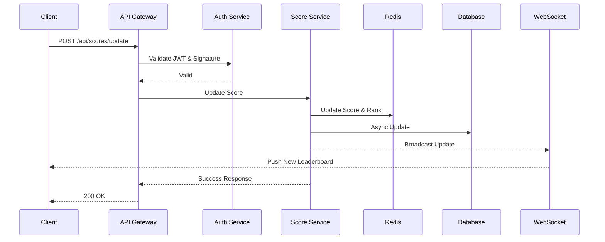

# Đặc tả Module Bảng Xếp Hạng Điểm Số Thời Gian Thực

## Tổng quan
Module này cung cấp các API endpoint để quản lý và cập nhật bảng xếp hạng điểm số người dùng theo thời gian thực. Hệ thống cho phép cập nhật điểm số an toàn và hiển thị top 10 người dùng có điểm cao nhất.

## Kiến trúc hệ thống

### Các thành phần chính
1. **API Service Layer**
   - REST API endpoints để cập nhật điểm số
   - WebSocket server để đẩy cập nhật realtime
   - Authentication & Authorization middleware

2. **Business Logic Layer**
   - Score Manager: Xử lý logic cập nhật điểm
   - User Manager: Quản lý thông tin người dùng
   - Leaderboard Manager: Quản lý bảng xếp hạng

3. **Data Layer**
   - Database chính (PostgreSQL/MySQL): Lưu trữ thông tin user và điểm số
   - Redis Cache: Cache bảng xếp hạng và xử lý realtime updates

## API Endpoints

### 1. Cập nhật điểm số
```
POST /api/v1/scores/update
Authorization: Bearer {jwt_token}

Request:
{
    "action_id": string,    // ID của hành động
    "timestamp": number,    // Thời điểm thực hiện hành động
    "signature": string     // Chữ ký số của request
}

Response:
{
    "success": boolean,
    "new_score": number,
    "rank": number
}
```

### 2. Lấy bảng xếp hạng
```
GET /api/v1/leaderboard
Response:
{
    "leaderboard": [
        {
            "user_id": string,
            "username": string,
            "score": number,
            "rank": number
        }
    ]
}
```

### 3. WebSocket Connection
```
WS /ws/leaderboard

// Server push event khi có cập nhật
{
    "type": "LEADERBOARD_UPDATE",
    "data": {
        "leaderboard": [...]  // Giống format GET /api/v1/leaderboard
    }
}
```

## Bảo mật

### Xác thực và Phân quyền
1. Sử dụng JWT (JSON Web Token) để xác thực người dùng
2. Token phải được gửi trong header "Authorization"
3. Mỗi request cập nhật điểm phải có chữ ký số

### Chống gian lận
1. Rate limiting theo user_id và IP
2. Validation chữ ký số cho mỗi request cập nhật
3. Kiểm tra timestamp của request để tránh replay attack
4. Logging chi tiết các hoạt động đáng ngờ

## Hiệu năng
1. Sử dụng Redis để cache bảng xếp hạng
2. Cập nhật Redis sorted set cho điểm số realtime
3. Batch update xuống database chính
4. Horizontal scaling cho API servers

## Monitoring
1. Prometheus metrics cho API endpoints
2. Grafana dashboards theo dõi:
   - API latency
   - WebSocket connections
   - Cache hit/miss ratio
   - Error rates
   - Suspicious activities

## Cải thiện trong tương lai
1. Sharding database theo user_id để scale
2. Thêm event sourcing để tracking lịch sử điểm số
3. Implement retry mechanism cho failed updates
4. Add support cho multiple game modes/leaderboards
5. Tích hợp hệ thống phát hiện gian lận tự động
6. Thêm API để export lịch sử điểm số
7. Implement websocket clustering cho high availability

## Configuration & Technical Details (English)

### Environment Variables
```env
# Server Configuration
PORT=3000
NODE_ENV=production
API_VERSION=v1

# Database Configuration
DB_HOST=localhost
DB_PORT=5432
DB_NAME=leaderboard
DB_USER=admin
DB_PASSWORD=****

# Redis Configuration
REDIS_HOST=localhost
REDIS_PORT=6379
REDIS_PASSWORD=****

# Security
JWT_SECRET=****
JWT_EXPIRATION=24h
SIGNATURE_SECRET=****
RATE_LIMIT_WINDOW=15m
RATE_LIMIT_MAX_REQUESTS=100

# WebSocket
WS_HEARTBEAT_INTERVAL=30000
WS_RECONNECT_TIMEOUT=5000

# Cache
LEADERBOARD_CACHE_TTL=300
SCORE_CACHE_TTL=60
```

### Technical Implementation Details

#### 1. Score Update Flow
- Each score update is atomic using Redis MULTI/EXEC
- Updates are queued and processed in order using Redis Lists
- Optimistic locking prevents race conditions
- Score changes are validated against action rules

#### 2. WebSocket Implementation
- Uses Socket.io for reliable bi-directional communication
- Implements room-based broadcasting for efficient updates
- Handles reconnection with message queuing
- Maintains connection state with heartbeat mechanism

#### 3. Caching Strategy
- Redis Sorted Sets (ZSET) for real-time leaderboard
- Two-level caching: Memory (Node.js) -> Redis -> Database
- Cache invalidation on score updates
- Periodic full sync with database

#### 4. Security Implementation
- Request signature: HMAC-SHA256(timestamp + action_id + user_id)
- JWT claims include: user_id, permissions, exp
- Rate limiting using sliding window with Redis
- IP-based request throttling

#### 5. Database Schema
```sql
-- Users Table
CREATE TABLE users (
    user_id UUID PRIMARY KEY,
    username VARCHAR(50) UNIQUE,
    created_at TIMESTAMP DEFAULT NOW()
);

-- Scores Table
CREATE TABLE scores (
    user_id UUID REFERENCES users(user_id),
    score BIGINT DEFAULT 0,
    last_updated TIMESTAMP,
    PRIMARY KEY (user_id)
);

-- Score History Table
CREATE TABLE score_history (
    id SERIAL PRIMARY KEY,
    user_id UUID REFERENCES users(user_id),
    action_id VARCHAR(50),
    score_change INT,
    timestamp TIMESTAMP,
    signature VARCHAR(256)
);

-- Indexes
CREATE INDEX idx_scores_score ON scores(score DESC);
CREATE INDEX idx_history_timestamp ON score_history(timestamp);
```

#### 6. Error Handling
```typescript
enum ErrorCodes {
    INVALID_SIGNATURE = 'ERR_INVALID_SIGNATURE',
    RATE_LIMIT_EXCEEDED = 'ERR_RATE_LIMIT',
    INVALID_ACTION = 'ERR_INVALID_ACTION',
    DUPLICATE_REQUEST = 'ERR_DUPLICATE',
    DATABASE_ERROR = 'ERR_DATABASE'
}

interface ErrorResponse {
    code: ErrorCodes;
    message: string;
    details?: object;
    timestamp: number;
}
```

## Sequence Diagram

